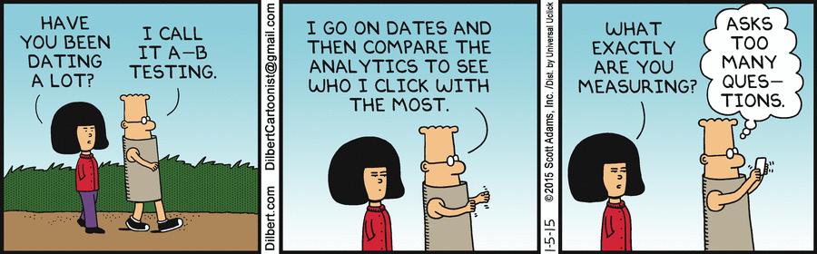

=======
## Get to know an {Economics Student + Data Enthusiast}

> ***About myself:*** I like to find meaning in a sea full of numbers. I strive to learn how data and visualizations can be leveraged to story tell complex problems facing the world, for example, finding ways to create GMOs that can solve world hunger. 

I have spent the past summer finding data-driven marketing insights for an online retailer [Natural Wellbeing](http://naturalwellbeing.com). Tools I used for work included:

* Google Analytics (provides granular website traffic information)
* R (statistical computing) Google Analytics API integration
* Tableau (data Visualization and KPI dashboards made easy)
* Optimizely (A/B Testing Tool)

**Knowledge Snippet:** If you don't already know this, *A/B testing* is a process that shows users different versions of a web page / app module and picks the winning page in terms of engagement using various statistical techniques. It is used by marketers and product designers globally to attract customers. 

*Enough of all this boring stuff. Here is a quick dating tip:*

 

Source: [Courtesy of Scott Adams and dilbert.com](http://dilbert.com/strip/2015-01-05)
