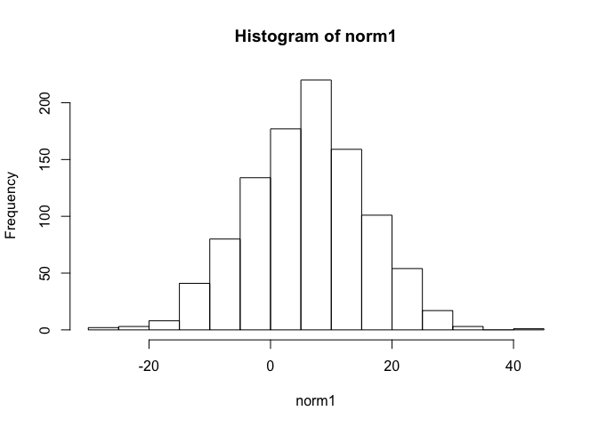
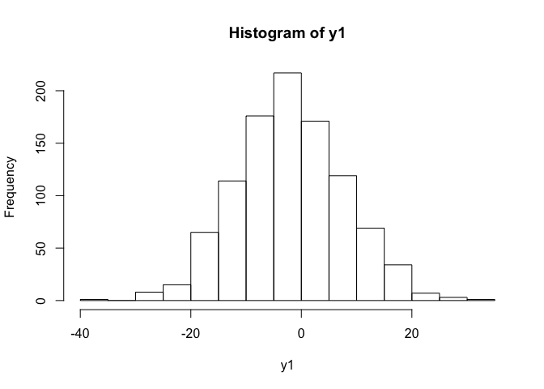
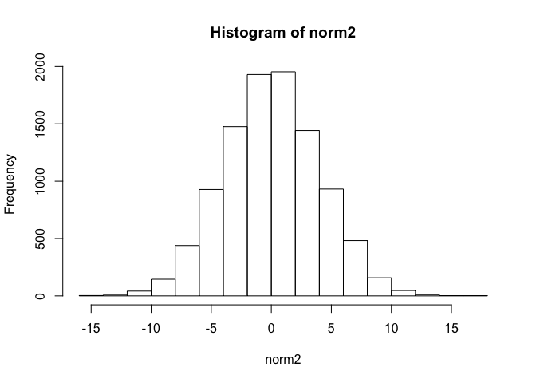
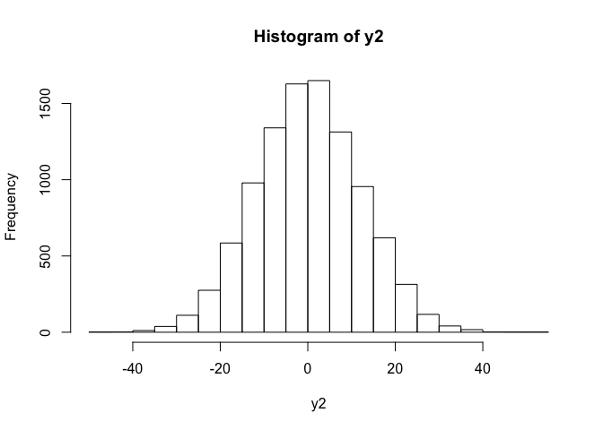
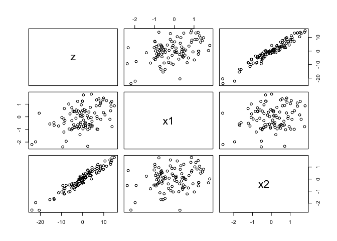

# Regression-Simulation
Parin Shah  
November 30, 2015  

##Part 1

###Question 1

We begin by sampling from a normal distribution and transforming it to a variable called ```y1```.


```r
# Random draws from a normal distribution
norm1 <- rnorm(1000, 6, 10)
# Constant
a <- 4
# Transformation
y1 <- a - norm1
```

1. True mean of ```norm1``` is 6, true standard dev is 10 and the true variance is 100. 
2. Approximated mean of ```norm1``` calculated using ```mean(norm1)``` equals 

```
## [1] 5.990665
```
  Approximated standard dev of ```norm1``` calculated using ```sd(norm1)``` equals 

```
## [1] 9.6793
```
  Approximated variance of ```norm1``` calculated using ```var(norm1)``` equals 

```
## [1] 93.68885
```
3. ```a``` is a constant with a value of 4.
4. Mean of ```y1``` = $4 - \mu_{norm1}$ = -2.191046, Variance of ```y1``` is $0 + s^2_{norm1}$ = 98.5769 and the standard dev of ```y1``` is $\sqrt{98.5769}$
5. Approximated mean of ```y1``` calculated using ```mean(y1)``` equals 

```
## [1] -1.990665
```
  Approximated standard dev of ```y1``` calculated using ```sd(y1)``` equals 

```
## [1] 9.6793
```
  Approximated variance of ```y1``` calculated using ```var(y1)``` equals 

```
## [1] 93.68885
```
Yes, the calculations concide with my expectations in 4. 
6. The function ```hist``` computes a histogram of the given data values. The output of ```hist``` tells us about the frequency of values in the matrix. Here is a histogram of ```norm1```
 


Here is a histogram of ```y1```


 

7. We used 1000 samples. If we used 100 samples instead, it would less approximate a normal distribution.

8. We regress ```y1``` on ```norm1```. 


```
## 
## Call:
## lm(formula = y1 ~ norm1)
## 
## Coefficients:
## (Intercept)        norm1  
##           4           -1
```

###Question 2

We begin by sampling from a normal distribution and transforming it to a variable called ```y2```.


```r
# Sample distribution 2
norm2 <- rnorm(10000, 0, 4)
b <- 3

y2 <- b*norm2
```

1. True mean of ```norm2``` is 0, true standard dev is 4 and the true variance is 16. 
2. Approximated mean of ```norm2``` calculated using ```mean(norm2)``` equals 

```
## [1] 0.05514647
```
  Approximated standard dev of ```norm2``` calculated using ```sd(norm2)``` equals 

```
## [1] 3.982506
```
  Approximated variance of ```norm2``` calculated using ```var(norm2)``` equals 

```
## [1] 15.86036
```
3. ```b``` is a constant with a value of 3.
4. Mean of ```y2``` = $3 * \mu_{norm2}$, Variance of ```y2``` is $9 *s^2_{norm2}$ and the standard dev of ```y2``` is $\sqrt{s^2}$
5. Approximated mean of ```y2``` calculated using ```mean(y2)``` equals 

```
## [1] 0.1654394
```
  Approximated standard dev of ```y2``` calculated using ```sd(y2)``` equals 

```
## [1] 11.94752
```
  Approximated variance of ```y2``` calculated using ```var(y2)``` equals 

```
## [1] 142.7432
```
Yes, the calculations concide with my expectations in 4. 
6. The function ```hist``` computes a histogram of the given data values. The output of ```hist``` tells us about the frequency of values in the matrix. Here is a histogram of ```norm2```
 


Here is a histogram of ```y2```


 

7. We used 1000 samples. If we used 100 samples instead, it would less approximate a normal distribution.

8. We regress ```y2``` on ```norm2```. 


```
## 
## Call:
## lm(formula = y2 ~ norm2)
## 
## Coefficients:
## (Intercept)        norm2  
##   3.553e-16    3.000e+00
```

###Question 3

We begin by sampling from a normal distribution and transforming it to a variable called ```y3```.


```r
# Sample distribution 3
norm3  <- rnorm(1500, 0, 5)
a <- 4
b <- 3

y3 <- a + b*norm3
```

We regress ```y3``` on ```norm3```. 


```
## 
## Call:
## lm(formula = y3 ~ norm3)
## 
## Coefficients:
## (Intercept)        norm3  
##           4            3
```

##Part 2


```r
# Sample from 2 normal distributions
x1 <- rnorm(100)
x2 <- rnorm(100)

# Construct constants
beta0 <- 0
beta1 <- 2
beta2 <- 8

# Construct equation
z <- beta0 + beta1*x1 + beta2*x2 + rnorm(100)
```

We regress using R's ```lm`` function based on the above equation


```
## 
## Call:
## lm(formula = z ~ x1 + x2 + rnorm(100))
## 
## Coefficients:
## (Intercept)           x1           x2   rnorm(100)  
##     0.07112      1.93631      7.92040      0.11848
```


```r
# Build a matrix from above
mat <- cbind(z, x1, x2)
```


```r
# Examine plots
pairs(mat)
```

 

##Part 3
